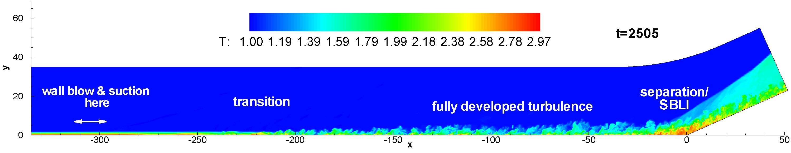
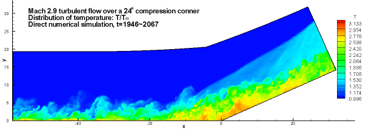
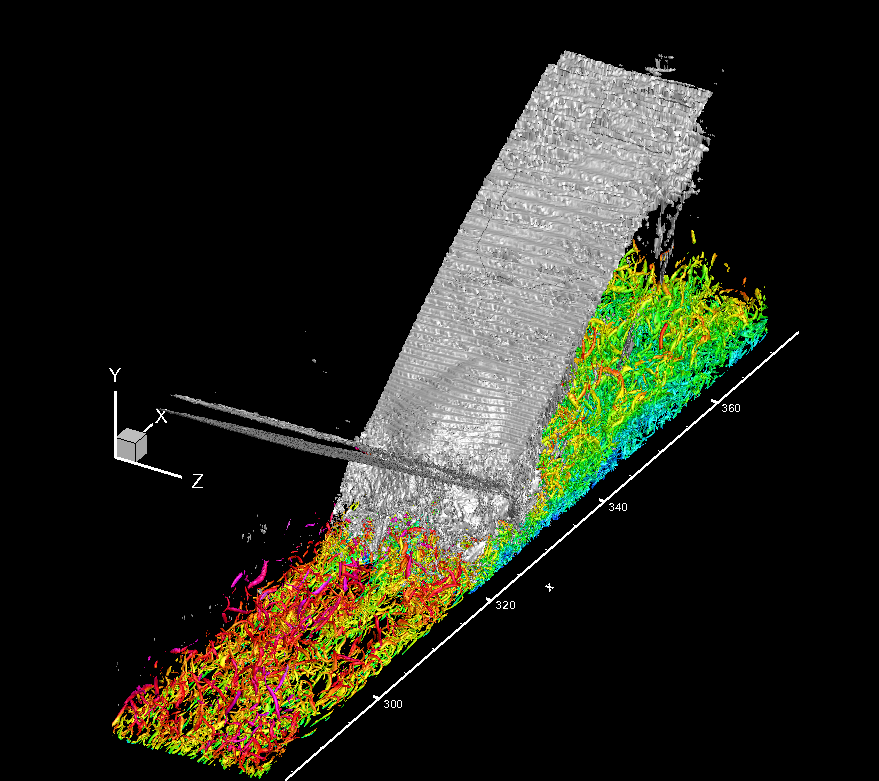
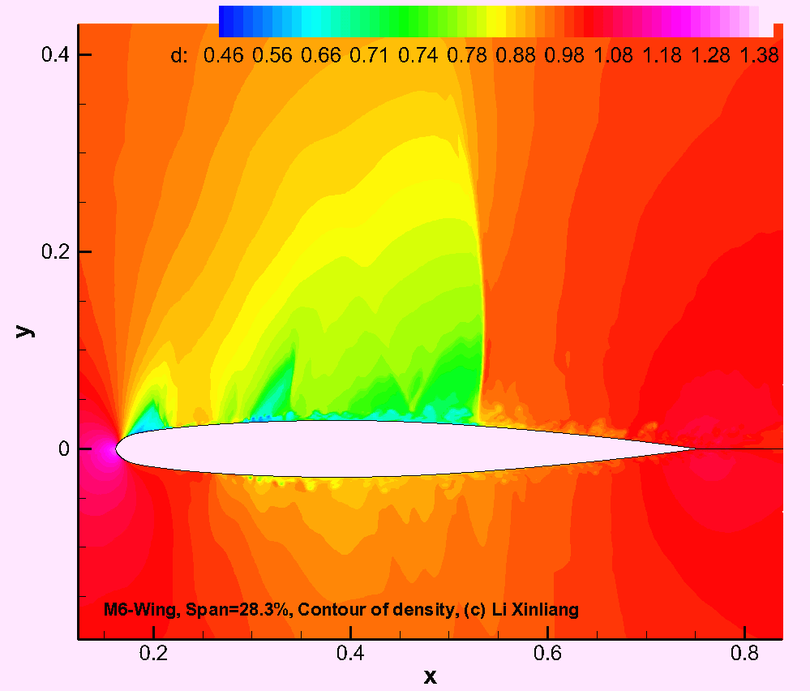
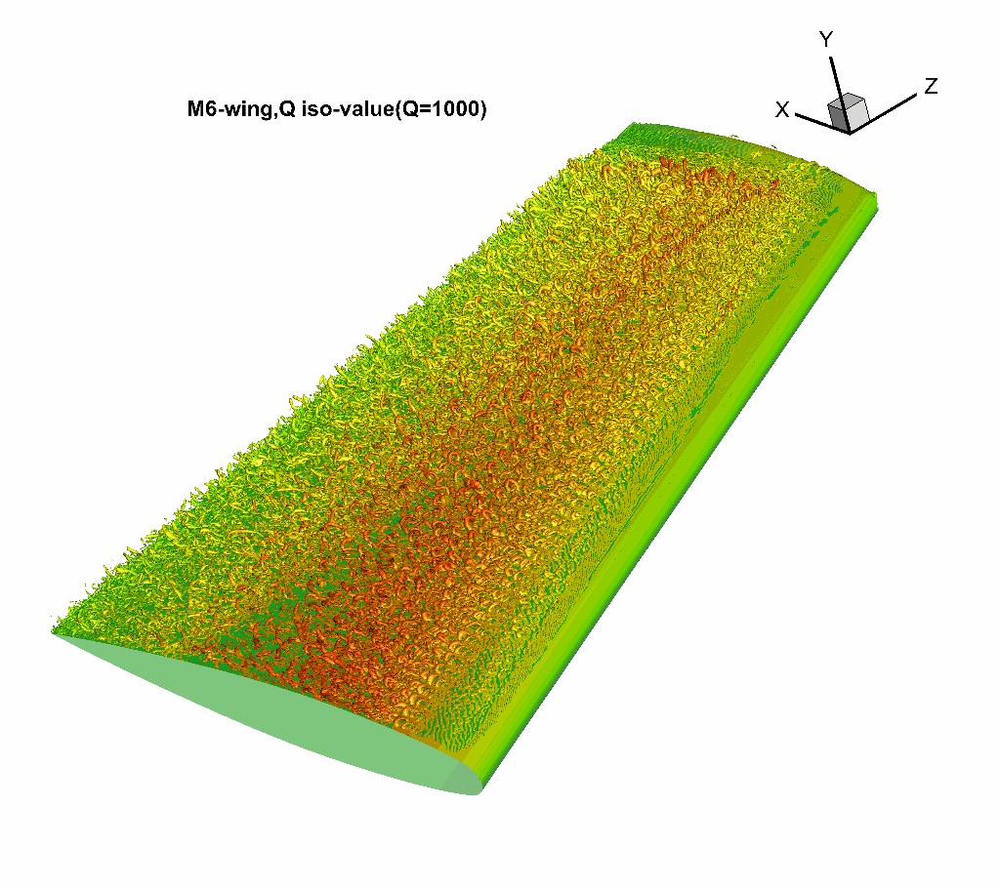
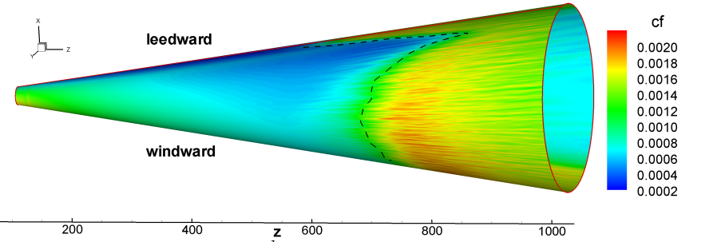
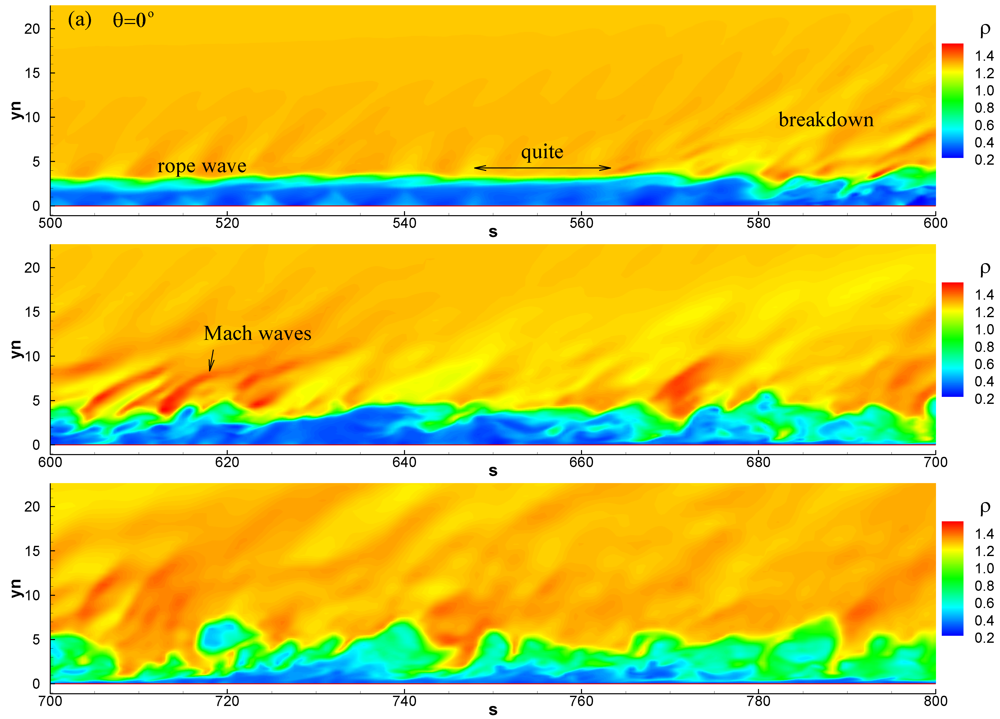
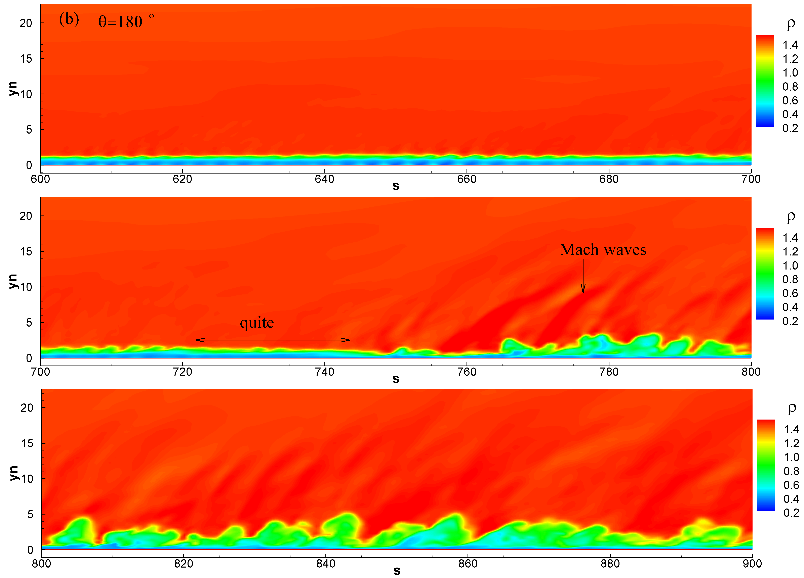
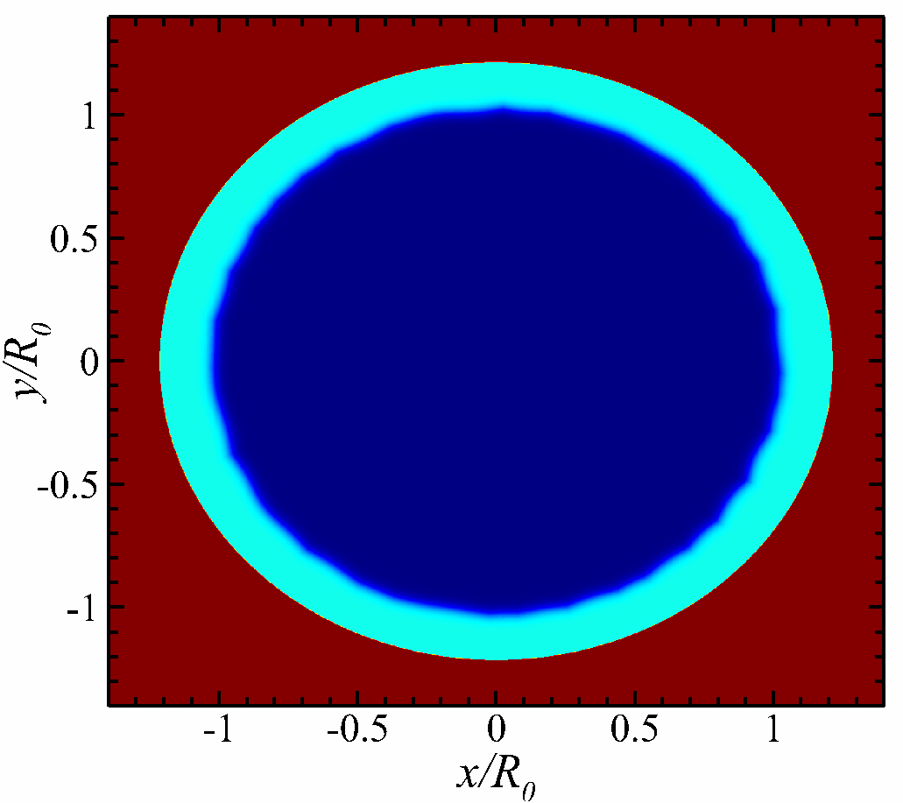

## Ma $2.9$, $24^\circ$ Compression Corner

- Xinliang Li, Dexun Fu，Yanwen Ma, Xian Liang, Direct Numerical Simulation of Shock/Turbulent Boundary Layer Interaction in a Supersonic Compression Ramp， Science China： Physics, Mechanics & Astronomy,  Vol.53 No.9: 1651–1658，2010
- Xingkun Zhu, Changping Yu, Fulin Tong, Xinliang Li, Numerical Study on Wall Temperature Effects on Shock Wave/Turbulent Boundary-Layer Interaction, AIAA Journal, 55(1):131-140,2017  (  https://doi.org/10.2514/1.J054939 )

## DNS of shock-wave turbulent boundary layer interaction

## DNS of turbulent/transition flow over ONERA-M6 wing

_Mach = $0.8395$, Re = $1.17\times 10^7$_

## DNS of transition of hypersonic flow over a blunt cone

## DNS of RM instability

- Zheng Yan, Yaowei Fu, Lifeng Wang, Changping Yu, Xinliang Li*，Effect of chemical reaction on mixing transition and turbulent statistics of cylindrical Richtmyer-Meshkov instability， J. Fluid  Mech. 941, A55 (2022)
- Xinliang Li, Yaowei Fu, Changping Yu*, Li Li*, Statistical characteristics of turbulent mixing in spherical and cylindrical converging Richtmyer–Meshkov instabilities. J. Fluid Mech. (2021), vol. 928, A10

## DNS of transition of lift-body "HyTRV"



- Han Qi, Xinliang Li, Changping Yu, Fulin Tong, Direct numerical simulation of hypersonic boundary layer transition over a lifting-body model HyTRV, Advances in Aerodynamics 3, 31 (2021)
